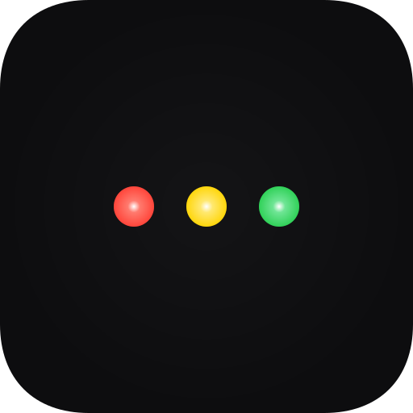

<p align="center">
  
</p>

<h1 align="center">claude-runner</h1>

<p align="center">
  A lightweight native macOS menu bar app that monitors Claude Code session status in real time
</p>

<p align="center">
  English | <a href="README.md">한국어</a>
</p>

<p align="center">
  <a href="https://github.com/jyami-kim/claude-runner/releases/latest"></a>
  <a href="https://github.com/jyami-kim/claude-runner/actions/workflows/ci.yml"></a>
  
  
  <a href="LICENSE"></a>
</p>

<p align="center">
  <a href="https://buymeacoffee.com/jyami.kim"></a>
</p>

---

When running Claude Code across multiple terminals/IDEs simultaneously, instantly see which sessions are waiting for user input and switch to them with a single click.

<p align="center">
  
</p>

## Key Features

| Feature | Description |
|---------|-------------|
| **Menu Bar Status Icon** | 4 styles (Traffic Light, Pie Chart, Domino, Text Counter) |
| **Session List Popover** | App icon, project name, elapsed time display |
| **Click-to-Focus** | Click a session to instantly switch to that terminal/IDE window |
| **macOS Notifications** | Alerts for permission requests and user input waiting (click to focus) |
| **Settings** | Icon style, path display format, stale timeout, and more |

### Supported Terminals/IDEs

| Terminal/IDE | App Activation | Tab/Window Switch | Method |
|------------|:---------:|:--------------:|------|
| **iTerm2** | ✅ | ✅ | AppleScript TTY matching |
| **Terminal.app** | ✅ | ✅ | AppleScript TTY matching |
| **JetBrains IDEs** | ✅ | ✅ | Toolbox CLI (worktree support) |
| **Ghostty** | ✅ | ❌ | App activation only |
| **Warp** | ✅ | ❌ | App activation only |
| **VS Code / Cursor / Zed** | ✅ | ❌ | App activation only |
| **Others** | ✅ | ❌ | `NSRunningApplication` fallback |

> \* tmux environments are supported for terminal icon display and tab switching.

## Status Indicators

| Color | Meaning | Trigger |
|-------|---------|---------|
| 🟢 Green | Claude is working | `UserPromptSubmit`, `PostToolUse` |
| 🟡 Yellow | Waiting for user input | `Stop`, `Notification(idle)` |
| 🔴 Red | Waiting for permission | `PermissionRequest`, `Notification(permission)`, `elicitation_dialog` |
| ⚪ All dim | No active sessions | 0 sessions |

When there are multiple sessions, a number badge appears on the corresponding color (2 or more).

<p align="center">
  
</p>

## Installation

### Homebrew (Recommended)

```bash
brew install jyami-kim/tap/claude-runner
```

### Manual Download

1. Download `claude-runner-x.x.x.zip` from the [latest release](https://github.com/jyami-kim/claude-runner/releases/latest)
2. Unzip and move `claude-runner.app` to `/Applications/`
3. `jq` must be installed (hook script dependency):
   ```bash
   brew install jq
   ```
4. Launch the app:
   ```bash
   open /Applications/claude-runner.app
   ```

### Build from Source

```bash
brew install jq  # hook script dependency
git clone https://github.com/jyami-kim/claude-runner.git
cd claude-runner
./install.sh
open /Applications/claude-runner.app
```

> The app automatically installs the hook script and registers it in `~/.claude/settings.json` on first launch. No additional setup required.

> ⚠️ Gatekeeper may show a warning on first launch. Go to **System Settings → Privacy & Security → "Open Anyway"**. This app is ad-hoc signed without an Apple Developer certificate, so macOS may flag it as an unverified app.

### Uninstall

| Install Method | Uninstall Method |
|----------------|------------------|
| Homebrew | `brew uninstall claude-runner` (auto cleanup of hooks + data) |
| Manual | Settings > Advanced > "Uninstall claude-runner..." |
| Source build | `./install.sh uninstall` |

## Update

| Install Method | Update Method |
|----------------|---------------|
| Homebrew | `brew update && brew upgrade claude-runner` |
| Manual download | Download from [latest release](https://github.com/jyami-kim/claude-runner/releases/latest) and replace in `/Applications/` |
| Source build | `git pull && ./install.sh` |

> You can check the current version and check for updates in the Version section at the bottom of Settings. For Homebrew installs, the upgrade command can be copied to clipboard directly.

## How It Works

```
Claude Code Hook (shell script)
    → ~/Library/Application Support/claude-runner/sessions/{session_id}.json
        → Swift app watches sessions/ directory (kqueue)
            → Menu bar icon update + popover session list
```

1. **Claude Code Hook**: Records state to individual JSON files on session events. Also captures terminal/IDE bundle ID and TTY from the parent process chain.
2. **Directory Watching**: Real-time file change detection via kqueue (near-zero CPU usage)
3. **Icon Update**: Traffic light dot brightness + badge number rendering per state
4. **Click-to-Focus**: iTerm2/Terminal.app use AppleScript TTY matching, JetBrains uses Toolbox CLI

<p align="center">
  
</p>

## Tech Stack

- **Swift 5.9** + **SwiftUI** (external dependency: `jq`)
- **Swift Package Manager** build
- **kqueue** (DispatchSource) file watching
- **NSAppleScript** terminal tab/window switching
- **JetBrains Toolbox CLI** IDE project window switching
- **Claude Code Hooks** integration

## Contributing

Issues and PRs are always welcome.

## License

MIT

---

<p align="center">
  <a href="https://buymeacoffee.com/jyami.kim"></a>
</p>
