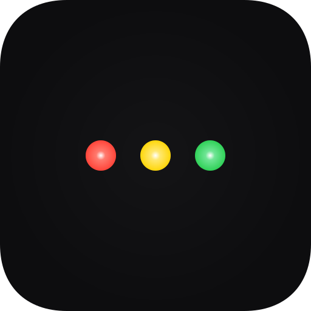

<p align="center">
  
</p>

<h1 align="center">claude-runner</h1>

<p align="center">
  macOS 메뉴바에서 Claude Code 세션 상태를 실시간 모니터링하는 경량 네이티브 앱
</p>

<p align="center">
  <a href="https://github.com/jyami-kim/claude-runner/releases/latest"></a>
  <a href="https://github.com/jyami-kim/claude-runner/actions/workflows/ci.yml"></a>
  
  
  <a href="LICENSE"></a>
</p>

<p align="center">
  <a href="https://buymeacoffee.com/jyami.kim"></a>
</p>

---

여러 터미널/IDE에서 Claude Code를 동시에 사용할 때, 어떤 세션이 유저 입력을 기다리는지 한눈에 파악하고, 클릭 한번으로 해당 창으로 전환할 수 있습니다.

<p align="center">
  
</p>

## 주요 기능

| 기능 | 설명 |
|------|------|
| **메뉴바 상태 아이콘** | 4가지 스타일 (신호등, 파이 차트, 도미노, 텍스트 카운터) |
| **세션 목록 팝오버** | 앱 아이콘, 프로젝트명, 경과시간 표시 |
| **클릭-to-포커스** | 세션 클릭 시 해당 터미널/IDE 창으로 즉시 전환 |
| **macOS 알림** | 권한 승인/유저 입력 대기 시 알림 (클릭 시 앱 포커스) |
| **설정** | 아이콘 스타일, 경로 표시 형식, 스테일 타임아웃 등 |

### 지원 터미널/IDE

- **iTerm2 / Terminal.app**: AppleScript TTY 매칭 (전체화면 Spaces 지원)
- **JetBrains IDEs**: Toolbox CLI 연동 프로젝트 창 전환
- **기타 앱**: `NSRunningApplication` 활성화 폴백

## 상태 표시

| 색상 | 의미 | 트리거 |
|------|------|--------|
| 🟢 초록 | Claude가 작업 중 | `UserPromptSubmit`, `PostToolUse` |
| 🟡 노랑 | 유저 입력 대기 | `Stop`, `Notification(idle)` |
| 🔴 빨강 | 권한 승인 대기 | `PermissionRequest`, `Notification(permission)`, `elicitation_dialog` |
| ⚪ 모두 흐림 | 활성 세션 없음 | 세션 0개 |

복수 세션 시 해당 색상 위에 숫자 배지가 표시됩니다 (2개 이상일 때).

<p align="center">
  
</p>

## 설치

### Homebrew (권장)

```bash
brew install --no-quarantine jyami-kim/tap/claude-runner
```

> `--no-quarantine` 플래그는 macOS Gatekeeper 경고를 방지합니다. 이 앱은 Apple Developer 인증서 없이 ad-hoc 서명되어 있어 플래그 없이 설치하면 "악성코드를 확인할 수 없습니다" 경고가 나타날 수 있습니다.

### 수동 다운로드

1. [최신 릴리스](https://github.com/jyami-kim/claude-runner/releases/latest)에서 `claude-runner-x.x.x.zip` 다운로드
2. 압축 해제 후 `claude-runner.app`을 `/Applications/`로 이동
3. Gatekeeper 격리 속성 제거 후 실행:
   ```bash
   xattr -cr /Applications/claude-runner.app
   open /Applications/claude-runner.app
   ```

### 소스 빌드

```bash
git clone https://github.com/jyami-kim/claude-runner.git
cd claude-runner
./install.sh
open /Applications/claude-runner.app
```

> 앱이 첫 실행 시 자동으로 Hook 스크립트를 설치하고 `~/.claude/settings.json`에 등록합니다. 별도 설정 불필요.

### 제거

| 설치 방법 | 제거 방법 |
|-----------|-----------|
| Homebrew | `brew uninstall claude-runner` (hook 정리 + 데이터 삭제 자동) |
| 수동/소스 | Settings > Advanced > "Uninstall claude-runner..." |
| 소스 빌드 | `./install.sh uninstall` |

## 작동 원리

```
Claude Code Hook (shell script)
    → ~/Library/Application Support/claude-runner/sessions/{session_id}.json
        → Swift 앱이 sessions/ 디렉토리 감시 (kqueue)
            → 메뉴바 아이콘 업데이트 + 팝오버 세션 목록
```

1. **Claude Code Hook**: 세션 이벤트 발생 시 개별 JSON 파일에 상태 기록. 부모 프로세스 체인에서 터미널/IDE 번들 ID와 TTY도 캡처.
2. **디렉토리 감시**: kqueue 기반 실시간 파일 변경 감지 (CPU 사용 거의 없음)
3. **아이콘 업데이트**: 상태별 신호등 원 밝기 + 배지 숫자 렌더링
4. **클릭-to-포커스**: iTerm2/Terminal.app은 AppleScript TTY 매칭, JetBrains는 Toolbox CLI

<p align="center">
  
</p>

## 기술 스택

- **Swift 5.9** + **SwiftUI** (외부 의존성 없음)
- **Swift Package Manager** 빌드
- **kqueue** (DispatchSource) 파일 감시
- **NSAppleScript** 터미널 탭/창 전환
- **JetBrains Toolbox CLI** IDE 프로젝트 창 전환
- **Claude Code Hooks** 연동

## 기여

이슈나 PR은 언제든 환영합니다.

## 라이선스

MIT

---

<p align="center">
  <a href="https://buymeacoffee.com/jyami.kim"></a>
</p>
